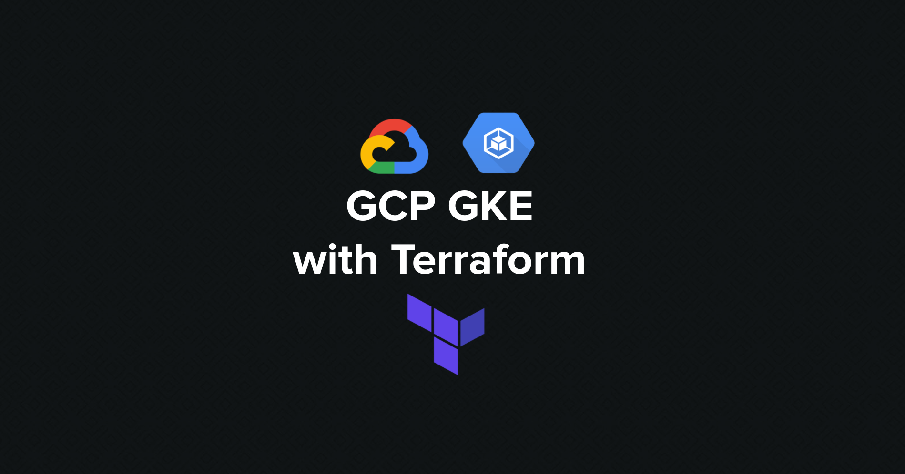
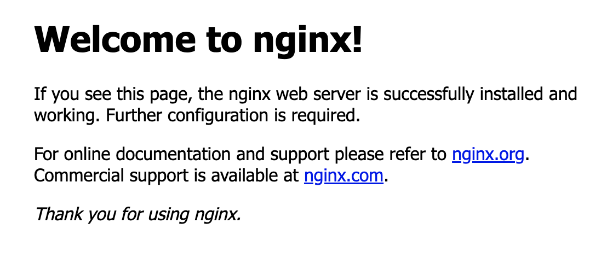

# my-gke-tf

This repository provides ideas on how one could structure various terraform modules and build scaffolding for their end user. The example in this repository creates a gke cluster within its own vpc.



## Summary

This repository has a top level terraform module [cluster](./cluster/README.md) which scaffolds [vpc_and_subnets](./modules/vpc_and_subnets/README.md) and [gke](./modules/gke/README.md) modules to create following resources -
- VPC
- Subnet
- GKE cluster with a default worker nodepool
- OR Optionally can create more k8s worker nodepools

## Links to module documentation

| Module Name | Documentation Link |
|-------------|--------------------|
| Cluster module with GKET, VPC and Subnets | [README](./cluster/README.md)
| GKE | [README](./modules/gke/README.md) |
| VPC And Subnets | [README](./modules/vpc_and_subnets/README.md) |

## Modularization of terraform

`cluster` is the top level module which is scaffold over `vpc_and_subnets` and `gke` modules. 

Essentially you can imagine that your infrastructure team is building APIs by building opinionated `vpc_and_subnets` and `gke` modules in different repository. And your team's Platform team building `cluster` module which makes use of these APIs. And top level `main.tf` file invoking `cluster` module, this can be written by your developer team member who wants to use the GKE Cluster. 

As you can see in the [cluster module's main.tf](./cluster/main.tf) we are invoking `vpc_and_subnets` and `gke` modules, and you can specify the `source` to remote github repository where your source of the modules are, you can read about [module sources](https://developer.hashicorp.com/terraform/language/modules/sources) in the official terraform documentation.

Hope by looking at the module structure you will find some ideas to modularize and structure your terraform.

## Prerequisites for this repository

- Basic understanding of GCP, [GKE](https://cloud.google.com/kubernetes-engine/docs/concepts/cluster-architecture), [VPC](https://cloud.google.com/vpc/docs/vpc), and [Terraform](https://developer.hashicorp.com/terraform).

- [GCP account](https://console.cloud.google.com/freetrial/signup/tos) and a [project](https://cloud.google.com/resource-manager/docs/creating-managing-projects) where you want to create the resources with necessary permissions to create VPC, Subnets, GKE Cluster etc..
  
- Configure [gcloud cli](https://cloud.google.com/sdk/docs/install) to point to your gcloud account, you will need this to generate the kubeconfig to connect to the cluster.
  
- Install [kubectl](https://kubernetes.io/docs/tasks/tools/#kubectl) compatible with the GKE version you are installing.
  
- Try to work with [Latest version of Terraform](https://developer.hashicorp.com/terraform/downloads). I have used `v1.5.2` on mac for this blog. If you want to manage multiple versions of Terraform use [tfswitch](https://tfswitch.warrensbox.com/Install/), I love it.
  
- If you want to learn how to generate the documentation from terraform files, install [terraform-docs](https://terraform-docs.io/user-guide/installation/)

- Install [helm](https://v3.helm.sh/docs/intro/install/) a package manager for Kubernetes manifests, we will use it to install [nginx helm chart](https://docs.nginx.com/nginx-ingress-controller/installation/installation-with-helm/#installing-the-chart) once the cluster is created.

## Prepare .tfvars file

`.tfvars` is a way to create the input files for terraform module. For example, you can create  `dev.tfvars` for `dev` environment, `test.tfvars` for `test` environment and so on. 

We have a [sample.tfvars](./sample.tfvars) for reference, substitute values as per your need and play around.

## Execute terraform to create the infrastructure

This section explains how to execute the terraform module [cluster](./cluster/README.md) to create vpc, subnets and gke cluster.

### main.tf

In [main.tf](./main.tf) tf file you will see that we are setting up the `google` provider and calling [cluster](./cluster/README.md) module. You will see that we are passing all the variables required by `cluster` modules.

### variables.tf

In [variables.tf](./variables.tf) tf file you will see declaration of all the variables we are taking input from `.tfvars` file and passing it to `cluster` module.

### outputs.tf

In [outputs.tf](./outputs.tf) tf file you will see declaration of any output variables we might need for our usage after the resources are created. These values are being copied from [cluster](./cluster/outputs.tf) module's output, which accumulates from [gke](./modules/gke/outputs.tf) and [vpc_and_subnets](./modules/vpc_and_subnets/outputs.tf) module outputs.

### How to execute

Execute all the commands below from `my-gke-tf` root where the above explained files are -

1. Make sure [gcloud cli](https://cloud.google.com/sdk/docs/install) is installed and configured to talk to the gcloud account. 

```shell
gcloud auth application-default login
```

2. Set the environment variables below -

```shell
export ARM_CLIENT_ID="The Client ID which should be used."
export ARM_CLIENT_SECRET="The Client Secret which should be used."
export ARM_SUBSCRIPTION_ID="The Subscription ID which should be used."
export ARM_TENANT_ID="The Tenant ID which should be used."
```

2. Make sure the s3 bucket to store the tfstate file exists, if not please create. Following is an example how you can use aws cli to create the s3 bucket.

```shell
aws s3api create-bucket --bucket "your-bucket-name" --region "your-aws-region"
```

3. Initialize the module and set the backend of `tfstate` file which records the state of the resources created by `terraform apply` invocation.
   
```shell
# tfstate file name
tfstate_file_name="<some name e.g. aks-1111111111>"

# tfstate s3 bucket name, this will have the tfstate file which you can use for further runs of this terraform module
# for example to upgrade k8s version or add new node pools etc.. The bucket name must be unique as s3 is a global service. Terraform will create the s3 bucket if it doesn't exist
tfstate_bucket_name="unique s3 bucket name you created above e.g. my-tfstate-<myname>"

# initialize the terraform module
terraform init -backend-config "key=${tfstate_file_name}" -backend-config "bucket=${tfstate_bucket_name}" -backend-config "region=us-east-1"
```

After execution of above, you will observe that, an s3 bucket is created in aws account.

4. Retrieve the `terraform plan`, a preview of what will happen when you apply this terraform module. This is a best practice to understand the change.

```shell
terraform plan -var-file="path/to/your/terraform.tfvars"

# example
terraform plan -var-file="sample.tfvars"
```

5. If you are satisfied with the plan above, this is the final step to apply the terraform and wait for the resources to be created. It will take about ~20 mins for all the resources to be created.

```shell
terraform apply -var-file="path/to/your/terraform.tfvars"

# example
terraform apply -var-file="sample.tfvars"
```

After successful execution, go to next section on how to connect to the AKS Cluster and install `nginx` helm chart.

## Connect to aks cluster and install nginx helm chart

In this section we will show how to connect to aks cluster and install `nginx` helm chart. This is just to prove that you have successfully created a functional aks cluster. This is with the assumption that you have installed all the cli tools mentioned in the prerequisites section above.

1. Retrieve kubeconfig using gcloud cli, assuming you have configured the gcloud cli properly to point to the gcp account which has the gke cluster. Please see [gcloud cli documentation](https://cloud.google.com/sdk/docs/install) for configuration details.

```shell

```

2. You can check if you are pointing to the right kubernetes cluster by running following kubectl command
   
```shell
kubectl config current-context
```

3. Install nginx helm chart

```shell
helm repo add bitnami https://charts.bitnami.com/bitnami
helm install -n default nginx bitnami/nginx
```

4. Check if all the pods are scheduled and running. Also validate that the load balancer is created, you can copy paste the `EXTERNAL-IP` and put it in browser (`http://<EXTERNAL-IP>:80`), you should see the `Welcome to nginx!` page as shown in the screenshot below.

```shell
kubectl get pods -n default
kubectl get svc -n default
```
```
# example
$ kubectl get pods -n default
NAME                     READY   STATUS    RESTARTS   AGE
nginx-7c8ff57685-ck9pn   1/1     Running   0          3m31s

$ kubectl get svc -n default nginx
NAME    TYPE           CLUSTER-IP   EXTERNAL-IP    PORT(S)        AGE
nginx   LoadBalancer   10.0.80.50   XX.XXX.XXX.X   80:30149/TCP   77s
```



## Cleanup

This is the most important step if you don't want any unexpected cloud costs on your account.

1. Make sure to uninstall the `nginx` helm chart to delete the loadbalancer before you start destroying the infrastructure in next step using `terraform destroy`. Make sure the `nginx` svc is deleted.

```shell
helm uninstall -n default nginx
```
```
# validate that the external service is deleted, it takes a few mins
$ kubectl get svc -n default nginx
Error from server (NotFound): services "nginx" not found
```

2. Destroy the infrastructure. It takes about ~15 mins to delete the infrastructure we created above.

```shell
terraform destroy -var-file="sample.tfvars"
```

## Terraform Documentation

### Requirements

No requirements.

### Providers

No providers.

### Modules

| Name | Source | Version |
|------|--------|---------|
| <a name="module_cluster"></a> [cluster](#module\_cluster) | [cluster](./cluster) | n/a |

### Resources

No resources.

### Inputs

| Name | Description | Type | Default | Required |
|------|-------------|------|---------|:--------:|
| <a name="input_cluster_name"></a> [cluster\_name](#input\_cluster\_name) | gke cluster name, same name is used for vpc and subnets | `string` | `"platformwale"` | no |
| <a name="input_k8s_version"></a> [k8s\_version](#input\_k8s\_version) | k8s version | `string` | `"1.27"` | no |
| <a name="input_region"></a> [region](#input\_region) | gcp region where the resources are being created | `string` | n/a | yes |

### Outputs

| Name | Description |
|------|-------------|
| <a name="output_endpoint"></a> [endpoint](#output\_endpoint) | The IP address of this cluster's Kubernetes master. |

## Handy commands

1. Generate documentation by running `terraform-docs` command from the module directory. Now you can copy the documentation from stdout.

```shell
cd ./modules/gke
terraform-docs markdown .
```

2. Format `hcl` files.

```shell
# recursively format all the files
terraform fmt -recursive

# just want to format a file
terraform fmt "<file/path>"
```

## Troubleshooting

1. If you see following error while executing `terraform init` command for the first time, this means the tfstate s3 bucket is not created, manually create the s3 bucket. You can read more details as mentioned in [terraform s3 backend documentation](https://developer.hashicorp.com/terraform/language/settings/backends/s3).

```
╷
│ Error: Failed to get existing workspaces: S3 bucket does not exist.
│
│ The referenced S3 bucket must have been previously created. If the S3 bucket
│ was created within the last minute, please wait for a minute or two and try
│ again.
│
│ Error: NoSuchBucket: The specified bucket does not exist
│ 	status code: 404, request id: 2R4WDEWZZQGXT7YD, host id: YHsfJYMpCvY5XcP+3rPzhpKl0kpmIku/VvSCjXfxHgskkTec7e0IPlm5PAjjCb3yUaKnlJ5HTMq3HgByAepruXbT2MyQEf/J
│
│
│
```

You can also use the below AWS Cli command to create the aws s3 bucket, make sure your aws cli is configured to point to the aws account where you want to run the terraform.

```shell
aws s3api create-bucket --bucket "your-bucket-name" --region "your-aws-region"
```

2. If you are seeing following error while executing `gcloud` command, you might need to install the correct version of python.

```
pjajoo-rmbp16:my-gke-tf piyush.jajoo$ gcloud auth application-default login
ERROR: gcloud failed to load: module 'collections' has no attribute 'Mapping'
    gcloud_main = _import_gcloud_main()
    import googlecloudsdk.gcloud_main
    from googlecloudsdk.calliope import cli
    from googlecloudsdk.calliope import actions
    from googlecloudsdk.calliope import markdown
    from googlecloudsdk.calliope import usage_text
    from googlecloudsdk.calliope import parser_arguments
    from googlecloudsdk.calliope import parser_completer
    from googlecloudsdk.core.console import progress_tracker
    class _BaseStagedProgressTracker(collections.Mapping):

This usually indicates corruption in your gcloud installation or problems with your Python interpreter.

Please verify that the following is the path to a working Python 2.7 or 3.5+ executable:
    /usr/local/bin/python3

If it is not, please set the CLOUDSDK_PYTHON environment variable to point to a working Python 2.7 or 3.5+ executable.

If you are still experiencing problems, please reinstall the Cloud SDK using the instructions here:
    https://cloud.google.com/sdk/
```

In my case I set environment variable `CLOUDSDK_PYTHON` to point to python 2.7.

```shell
export CLOUDSDK_PYTHON=/Library/Frameworks/Python.framework/Versions/2.7/bin/python
```